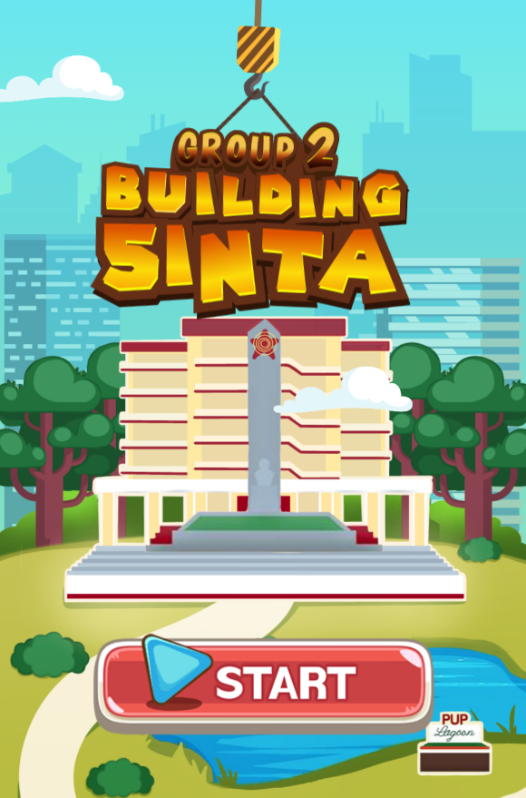

[](LICENSE)

<h1 align="center">Building Sinta🍃</h1>
<h2 align="center">Group 2: HCI Final Project</h1>

> a tower building game based on ES6 and Canvas (hulaan nyo anong building sa PUP char)
<p align="center">
  
</p>


## Game Rule

The following are the default game rule:

- In every game player starts with 3 hp. Every time a Tower block is dropped player is deduct 1 hp; game ends when hp is depleted.

- Player is rewarded with 25 point for every succesful stacked blocks(Success). If a block is stacked pefectly (Perfect) on top of the previous one, then player
rewarded with 50 points instead. Consecutive Perfects awards additional 25 points.

**Note: Each Success or Perfect constitutes a floor**

  For example, the first Perfect awards 50 point. The second consecutive Perfect awards 75 points.
 The third consecutive Perfect awards 100 points.  etc.


## To open the game locally:

```
git clone https://github.com/jeayuun/HCI.git
cd HCI
npm install
npm start
```
Open `http://localhost:8082` in a web browser.

## License

MIT license.
